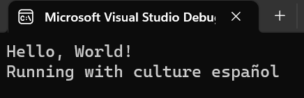

# Puzzle-5

Let's work with Culture in our Blazor applications.

In this puzzle, we've grabbed some code from a larger application and simplified it to show the puzzling problem.

Included is a Console application that shows what type of interaction we're looking for:  the application should be able to specify a culture and then output information about the culture.  In this case, set the culture to `es` and have it report the NativeName for the culture like this:



However, when we start our Blazor sample project that configures the culture in the `Program.cs` file.

```csharp
var builder = WebAssemblyHostBuilder.CreateDefault(args);
builder.RootComponents.Add<App>("#app");
builder.RootComponents.Add<HeadOutlet>("head::after");

builder.Services.AddScoped(sp => new HttpClient { BaseAddress = new Uri(builder.HostEnvironment.BaseAddress) });

// Our code to set culture
var culture = new CultureInfo("es");
CultureInfo.DefaultThreadCurrentCulture = culture;
CultureInfo.DefaultThreadCurrentUICulture = culture;

// Verify the culture is set for the application
Console.WriteLine($"Running with culture {culture.NativeName}");

await builder.Build().RunAsync();
```

This application doesn't start properly. 

Your question this week Blazor Puzzlers is: Why, and how do you fix this?  

For bonus points: there is a secondary bug here, what is that bug?